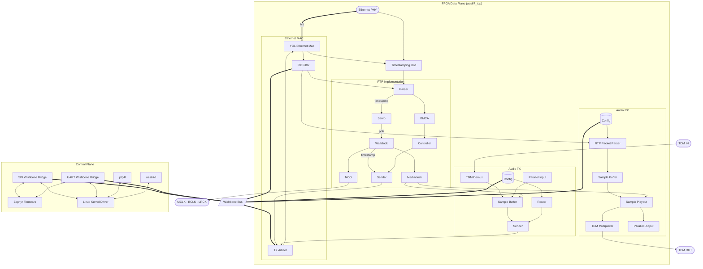
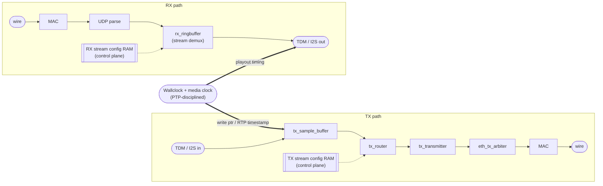

# AES67

A full AES67 Audio-over-IP implementation built around a single FPGA. The FPGA owns the entire **data plane** — Ethernet MAC, IEEE 1588 (PTPv2), a PTP-disciplined wallclock, media-clock derivation, RTP packetisation and TDM/I2S audio I/O — while a separate, swappable **control plane** handles the non-realtime work (network management, PTP grandmaster selection, stream announcement/discovery, configuration, web UI).

The defining feature of the design is that the control plane is **not fixed to one host**. The FPGA exposes its whole register set as a **Wishbone-slave bridge** (LiteX CSR map), and that bridge can be driven by:

- an **integrated LiteX RISC-V softcore** (VexRiscv) running Zephyr RTOS *on the same FPGA* (single-chip endpoint), or
- an **external MCU** (e.g. an ESP32-S3) running the *same* Zephyr control-plane firmware over SPI, or
- an **external Linux host** (e.g. a Raspberry Pi): the **`aes67_eth` kernel driver** turns the FPGA into a normal `net_device` with a PTP hardware clock (so stock **`ptp4l`** disciplines the wallclock) and owns the SPI→Wishbone (`spibone`) bus, and the Rust [`config_tool`](config_tool/) stack (daemon/CLI/web/discovery) runs **on top of that driver**, reaching the FPGA registers through it.

---

## Table of Contents

- [System Overview](#system-overview)
- [Control-Plane Backends](#control-plane-backends)
- [FPGA Architecture (Data Plane)](#fpga-architecture-data-plane)
- [Control Interface (Wishbone / LiteX CSR)](#control-interface-wishbone--litex-csr)
- [LiteX SoC & Bus Bridges](#litex-soc--bus-bridges)
- [Host Control Plane — Linux (`config_tool`)](#host-control-plane--linux-config_tool)
- [Linux Kernel Driver & Software PTP](#linux-kernel-driver--software-ptp)
- [Firmware — Integrated Softcore (Zephyr)](#firmware--integrated-softcore-zephyr)
- [Supported Boards](#supported-boards)
- [Building](#building)
- [Status & Known Issues](#status--known-issues)
- [Technical Notes](#technical-notes)
- [License](#license)

---

## System Overview



The data-plane logic is identical regardless of who drives it; only the **Wishbone master** in front of the [aes67_wb_bridge](FPGA/aes67_wb_bridge.vhd) changes. On the FPGA side the master is chosen by the `SOC_TYPE` generic on [soc_top.vhd](FPGA/soc_top.vhd) (and by which LiteX target is generated). On the host side, the Zephyr firmware ([soc_firmware/app/](soc_firmware/app/)), the Rust [config_tool](config_tool/), and the [`aes67_eth`](driver/aes67_eth/) kernel driver all speak to the same register names resolved from the generated CSR map.

---

## Control-Plane Backends

| Backend | LiteX target / `SOC_TYPE` | Host | Transport | Notes |
|---------|----------------------------|------|-----------|-------|
| **Integrated softcore** | `cyclone10` / `cyc1000` / `gowin` (`LITEX_HRAM` / `LITEX_SDRAM`) | On-FPGA VexRiscv + Zephyr | LiteX CSR over Wishbone | Self-contained single-chip system; SoC boots from SPI flash. |
| **External MCU (Zephyr)** | `spibone` (`LITEX_SPIBONE`) | ESP32-S3 (same Zephyr firmware) | SPI → Wishbone | Active target; the SPI driver still needs porting from the old `spictrl` byte protocol to `spibone`. |
| **External Linux host** | `aes67_bridge` + `--ptp-in-software`, driven over `spibone` | Linux (e.g. Raspberry Pi) | SPI→Wishbone via `aes67_eth.ko` | The `aes67_eth` kernel driver provides `net_device` + PHC (stock `ptp4l` disciplines the wallclock) and owns the bus; the Rust `config_tool` stack runs on top of it (daemon, CLI, web, discovery, TAP bridge). |

> For bring-up/debug, `config_tool` can also open a `spibone`/`uartbone` bridge **directly** (`aes67cfg --spi`/`--uart`) without the kernel driver — but the full Linux control plane (with `ptp4l` hardware PTP) runs through `aes67_eth.ko`, the single Wishbone master.
>
> The earlier external-MCU path used a hand-rolled SPI **byte-command** protocol in `spictrl.vhd`. That FPGA block and its `config_ram_address_map.md` have been **removed** in favour of the CPU-less Wishbone bridge (`spibone`/`uartbone`); the ESP32-S3 driver just needs porting onto it.

---

## FPGA Architecture (Data Plane)

All time-critical audio and timing logic lives in [FPGA/](FPGA/). New logic is VHDL; a few audio-clock helpers are Verilog.

- [FPGA/aes67_top.vhd](FPGA/aes67_top.vhd) — the data-plane core (MAC + PTP + wallclock + audio TX/RX).
- [FPGA/aes67_wb_bridge.vhd](FPGA/aes67_wb_bridge.vhd) — wraps the core and exposes its register set + the Ethernet control-plane buffer (`eth_buf`) as a **Wishbone slave**. This is the single point all control-plane hosts talk to.
- [FPGA/soc_top.vhd](FPGA/soc_top.vhd) — board/SoC wrapper: instantiates the data plane plus the chosen LiteX core (full VexRiscv SoC, or a CPU-less `spibone`/`uartbone` master) selected by the `SOC_TYPE` generic.
- [FPGA/wb_bridge_top.vhd](FPGA/wb_bridge_top.vhd) — a leaner CPU-less wrapper (bridge + master only, no softcore).

### Ethernet
| Module | File | Description |
|--------|------|-------------|
| Ethernet MAC | [FPGA/FPGA_Ethernet/](FPGA/FPGA_Ethernet/) | Fork of the YOL MAC with start-of-frame timestamp output (git submodule) |
| RMII/SMII bridge | [FPGA/mii_rmii/](FPGA/mii_rmii/) | RMII↔MII glue for 100 Mbit PHYs (git submodule) |
| MII converters | [FPGA/mii_converters.vhd](FPGA/mii_converters.vhd) | MII width/type adaptation between PHY and MAC |
| MII timestamp | [FPGA/ethernet_timestamp_mii.vhd](FPGA/ethernet_timestamp_mii.vhd) | Latches the 48b:32b wallclock at the SOF delimiter |
| TX arbiter | [FPGA/eth_tx_arbiter.vhd](FPGA/eth_tx_arbiter.vhd) | Arbitrates PTP / audio / control-plane egress onto the MAC |
| Packet aggregator | [FPGA/ethernet_packet_aggregator.vhd](FPGA/ethernet_packet_aggregator.vhd) | Assembles outgoing frames |
| Eth control buffer | [FPGA/litex_eth_buffer_bridge.vhd](FPGA/litex_eth_buffer_bridge.vhd) | Dual-port RX/TX packet buffers (`eth_buf`) between MAC and the control host; appends the RX hardware-timestamp trailer in software-PTP mode |

### PTP (IEEE 1588 / PTPv2)
| Module | File | Description |
|--------|------|-------------|
| PTP module | [FPGA/ptp/ptp_module.vhd](FPGA/ptp/ptp_module.vhd) | Top-level PTP block; selects **hardware** vs **software** PTP via `PTP_IN_SOFTWARE` |
| Controller | [FPGA/ptp/ptpv2_controller.vhd](FPGA/ptp/ptpv2_controller.vhd) | State machine: Sync, Follow_Up, Announce, Delay_Req/Resp |
| Parser | [FPGA/ptp/ptpv2_parser.vhd](FPGA/ptp/ptpv2_parser.vhd) | Extracts timestamps, computes offset / mean path delay |
| Servo | [FPGA/ptp/ptpv2_servo.vhd](FPGA/ptp/ptpv2_servo.vhd) | PI controller for clock discipline (PPB output) |
| Moving average | [FPGA/ptp/average.vhd](FPGA/ptp/average.vhd) | Configurable moving-average filter (`PTP_MOVING_AVERAGE_DEPTH`) |
| Wallclock | [FPGA/ptp/wallclock.vhd](FPGA/ptp/wallclock.vhd) | PTP-disciplined 48-bit seconds + 32-bit nanoseconds + media clock |

In **hardware PTP** mode the FPGA runs the full PTPv2 engine on-chip and the control plane only runs the **BMC** (best-master-clock) decision, feeding the resulting grandmaster priorities/identity back over the bus. In **software PTP** mode (`PTP_IN_SOFTWARE = true`, gateware built with `--ptp-in-software`) the FPGA provides only hardware timestamping and CSR access to the wallclock, and a host PTP stack (`ptp4l` via the kernel driver, or Zephyr's `CONFIG_PTP`) disciplines it.

### Clock & Timing
| Module | File | Description |
|--------|------|-------------|
| Wallclock + media clock | [FPGA/ptp/wallclock.vhd](FPGA/ptp/wallclock.vhd) | NCO phase reference + media-clock counter for RTP timestamps |
| Audio clock gen | [FPGA/audioclock_generator_sysclk.vhd](FPGA/audioclock_generator_sysclk.vhd) | Derives the BCLK/LRCK/TDM-frame domain from sysclk |
| System PLL gen | [FPGA/sysclk_pll_gen.vhd](FPGA/sysclk_pll_gen.vhd) | Per-platform system/PLL clock generation |
| PPB meter | [FPGA/clock_ppb_meter.vhd](FPGA/clock_ppb_meter.vhd) | Measures NCO-vs-external-PLL phase → PPB correction |
| Packages | [FPGA/packages/audioclks_pkg.vhd](FPGA/packages/audioclks_pkg.vhd), [FPGA/packages/wallclock_signals_pkg.vhd](FPGA/packages/wallclock_signals_pkg.vhd) | Shared audio-clock and wallclock signal bundles |

### Audio
| Module | File | Description |
|--------|------|-------------|
| TX module | [FPGA/audio_tx/audio_tx_module.vhd](FPGA/audio_tx/audio_tx_module.vhd) | Wraps the TX path |
| TX router | [FPGA/audio_tx/tx_router.vhd](FPGA/audio_tx/tx_router.vhd) | Per-stream config RAM, sample aggregation |
| TX transmitter | [FPGA/audio_tx/tx_transmitter.vhd](FPGA/audio_tx/tx_transmitter.vhd) | RTP packet construction with SSRC |
| TX sample buffer | [FPGA/audio_tx/tx_sample_buffer.vhd](FPGA/audio_tx/tx_sample_buffer.vhd) | Media-clock-paced ring buffer; integrated TDM demux |
| TDM8 in | [FPGA/audio_tx/tdm8_in.vhd](FPGA/audio_tx/tdm8_in.vhd) | 8-channel TDM input (legacy parallel path) |
| RX ringbuffer | [FPGA/audio_rx/rx_ringbuffer.vhd](FPGA/audio_rx/rx_ringbuffer.vhd) | Stream demux + playout buffer |
| TDM8 out | [FPGA/audio_rx/tdm8_out.vhd](FPGA/audio_rx/tdm8_out.vhd) | 8-channel TDM output |

Audio framing is now **TDM-centric**: I2S is handled as a mode of the TDM path (`TDM_I2S_MODE`) rather than a separate serialiser, so a single set of modules covers I2S and TDM8.

### Configurable Generics

The core is parameterised through the generics on [aes67_top.vhd](FPGA/aes67_top.vhd) (mirrored by [soc_top.vhd](FPGA/soc_top.vhd) / [wb_bridge_top.vhd](FPGA/wb_bridge_top.vhd)). The most useful ones:

| Generic | Typical default | Purpose |
|---------|-----------------|---------|
| `SOC_TYPE` | `"LITEX_HRAM"` | Control-plane core: `LITEX_HRAM`, `LITEX_SDRAM`, `LITEX_SPIBONE`, `LITEX_UARTBONE` |
| `platform` | `"ALTERA"` | `"ALTERA"` or `"GOWIN"` vendor glue |
| `ETHERNET_TYPE` / `MII_WIDTH` | `"RMII"` / `2` | PHY interface (`RMII` 100 Mbit or `RGMII` Gigabit) and MII data width |
| `SYS_CLK_NS_PER_TICK` / `MII_CLK_NS_PER_TICK` | `8` / `20` | System (125 MHz) and MII clock periods — keep in sync with the actual clocks |
| `TX_MAX_STREAMS` / `RX_MAX_STREAMS` | `8` / `8` | Maximum concurrent TX / RX RTP streams |
| `TX_CHANNELS` / `RX_CHANNELS` | `16` / `16` | Audio channel count (×2 for I2S, ×8 for TDM8) |
| `TX_BYTE_DEPTH` / `RX_BYTE_DEPTH` | `3` / `3` | Sample width in bytes (3 = 24-bit) |
| `TX_SAMPLE_BUFFER_DEPTH` | `64` | TX ring depth — **must be a power of two** (media-clock write pointer) |
| `RX_SAMPLE_BUFFER_DEPTH` | `256` | RX playout buffer depth (latency vs. jitter tolerance) |
| `AUDIO_TX/RX_TDM_CHANNELS` / `..._TDM_INPUTS/OUTPUTS` | `8` / `1–2` | TDM lane width and number of TDM data lines per direction |
| `TDM_I2S_MODE` / `TDM_BCLK_MULT` / `TDM_FSCLK_50DUTY` | `false` / `256` / `false` | I2S framing mode, BCLK multiplier, 50 %-duty frame sync |
| `AUDIO_TX/RX_USE_PARALLEL_INTERFACE` | `false` | `false` = integrates tdm mux/demux `true` exposes raw sample values |
| `USE_EXTERNAL_PLL` | `true` | `true` = drive audio clocks from the external Si5351A; `false` = use the on-chip NCO-generated clocks directly |
| `ENABLE_METERING` | `true` | Per-channel signal/clip metering; set `false` to drop it and save logic |
| `STATIC_PTP_CONF` | `true` | `true` = compile-time PTP servo/parser config; `false` = runtime-tunable from the control plane |
| `PTP_MOVING_AVERAGE_DEPTH` | `8` | Depth of the PTP offset/delay moving-average filter |
| `PTP_IN_SOFTWARE` | `false` | `true` = host runs PTP (timestamping only in HW); `false` = full HW PTP engine |
| `MIIM_CLOCK_DIVIDER` / `MIIM_PHY_ADDRESS` | `50` / `0` | MDIO clock divider and PHY management address |

Defaults give a 48 kHz / 24-bit endpoint with up to 8 TX and 8 RX streams over 16 channels each.

### Data Flow



---

## Control Interface (Wishbone / LiteX CSR)

Every control-plane host reaches the data plane through the **Wishbone-slave register set** in [aes67_wb_bridge.vhd](FPGA/aes67_wb_bridge.vhd), exposed as a LiteX **CSR** map. There is no longer a bespoke byte-command protocol — the bridge is a standard memory-mapped register block, so:

- The **integrated VexRiscv** accesses CSRs directly over its internal Wishbone bus.
- An **external Linux host** reaches the same CSRs over a CPU-less bridge — `spibone` (SPI→Wishbone) or `uartbone` (UART→Wishbone) — generated by LiteX. The host issues word `peek`/`poke` reads/writes at byte addresses; each bridge applies its own address convention internally.
- The **register map is resolved at runtime** from the LiteX-generated `csr.csv` / `csr.json` (for the `aes67_bridge` build). Regenerate the gateware and every host tracks the new addresses automatically — nothing is hard-coded.

Logical register groups exposed by the bridge include: device info; MAC/IP; control flags and per-domain reset (`aes67_csr_reset`, all-held at power-on, active-high); PTP grandmaster params and servo/parser tuning; PTP status (offset, mean path delay, grandmaster identity, lock); clocking/PPB status; channel metering; the Ethernet control buffer (`eth_buf`, RX-drain / TX-inject); and the write-only **TX/RX stream config RAMs** (up to 8 streams each). The authoritative, byte-exact field conventions live in the on-target driver [eth_litex.c](soc_firmware/app/drivers/eth_litex/eth_litex.c) and are mirrored by the Rust `aes67-config` crate.

---

## LiteX SoC & Bus Bridges

The LiteX SoC and the CPU-less bridges are generated by [litex_soc/generate.py](litex_soc/generate.py), which drives the [`aes67_soc`](litex_soc/aes67_soc/) Python package (one module per concern: [platform](litex_soc/aes67_soc/platform.py), [CRG](litex_soc/aes67_soc/crg.py), [SoC assembly](litex_soc/aes67_soc/soc.py), and [peripherals/](litex_soc/aes67_soc/peripherals/)). It emits portable Verilog into `litex_soc/build/`; the FPGA top-level feeds it clocks (no SoC-internal PLL).

### Targets

```bash
source soc_firmware/.venv/bin/activate
python litex_soc/generate.py --target <name>
```

| Target | Kind | Role |
|--------|------|------|
| `aes67_bridge` | Wishbone **slave** | The AES67 peripheral/register block — *the only target that builds the AES67 peripherals*; every other target is a master to it. Produces the canonical `csr.csv`. |
| `cyclone10` | Full VexRiscv SoC | Integrated softcore + HyperRAM (Cyclone 10LP eval) |
| `cyc1000` | Full VexRiscv SoC | Integrated softcore + SDRAM (CYC1000) |
| `gowin` | Full VexRiscv SoC | Integrated softcore + DDR3 (Tang Primer 20K) |
| `spibone` | CPU-less master | SPI→Wishbone bridge for an external host |
| `uartbone` | CPU-less master | UART→Wishbone bridge for an external host |

The CPU-less targets drop everything CPU-adjacent (VexRiscv, BIOS, boot stub) and just present a Wishbone master that drives the `aes67_bridge` slave across the FPGA top-level. The `spibone` master uses a forked [spi_bone.py](litex_soc/spi_bone.py) with burst commands for throughput.

### Integrated SoC resources & boot
| Resource | Details |
|----------|---------|
| CPU | VexRiscv RISC-V (sys clock typ. 75–80 MHz, supplied by top-level) |
| RAM | HyperRAM (Cyclone 10LP) or SDRAM (CYC1000) / DDR3 (Gowin) @ `0x20000000` |
| Flash | SPI flash (BIOS + firmware) @ `0x30000000` |
| CSR | Peripheral registers @ `0xf0000000` |
| Ethernet | MAC ↔ SoC via [litex_eth_buffer_bridge.vhd](FPGA/litex_eth_buffer_bridge.vhd) (dual-port packet buffers) |
| I2C / SPI / UART | Display + Si5351A PLL, SD card, console |

Boot flow (integrated softcore): FPGA configures from its own flash → a RISC-V boot stub at the SPI-flash reset vector ([litex_soc/boot_stub/](litex_soc/boot_stub/)) copies the LiteX BIOS into RAM and sets the HyperRAM latency (6 CK) → the BIOS loads the Zephyr `.fbi` image (binary + length + CRC-32) → Zephyr boots and starts DHCP and the application threads.

> Firmware merges the CPU SoC's CSR header with the `aes67_bridge` CSR header via [merge_litex_csr.py](soc_firmware/app/scripts/merge_litex_csr.py) (run from CMake), so the AES67 register addresses match the standalone bridge build.

---

## Host Control Plane — Linux (`config_tool`)

[config_tool/](config_tool/) is a Rust workspace that runs the control plane on an external Linux host (typically a Raspberry Pi). In the normal Linux deployment it runs **on top of the [`aes67_eth` kernel driver](#linux-kernel-driver--software-ptp)** (next section): the driver owns the SPI→Wishbone bus and provides the `net_device` (+PHC for `ptp4l`), and `config_tool` reaches FPGA registers through the driver's `/dev/aes67ctl` peek/poke char device. It has no native C dependencies, so it cross-compiles cleanly to ARM. See [config_tool/README.md](config_tool/README.md) for the full guide.

- **`aes67d`** (daemon) — serves a control API over a Unix socket and persists FPGA settings to a JSON config, replaying them on restart. Drives **IGMP** membership on behalf of the data plane, triggers DHCP on link-up, mirrors Linux IP → FPGA IP CSR, and runs a **staged reset bring-up** with warm-restart and auto-recovery (the gateware powers up with all reset domains held). With the kernel driver it works through the `net_device`/`/dev/aes67ctl`; in standalone bring-up mode it can instead own a `spibone`/`uartbone` link directly and bridge `eth_buf` into its own TAP.
- **`aes67cfg`** (CLI) — read/write registers by name (`get`/`set`/`dump`/`peek`/`poke`), set MAC/IP/PTP grandmaster, configure RX/TX streams, list discovered streams. Talks to the daemon by default, or directly to the FPGA with `--spi`/`--uart` for bring-up.
- **`aes67web`** — a standalone monitoring/config web dashboard (embedded HTML, REST API), itself just another client of the daemon.
- **Discovery** — SAP/SDP announcement + foreign-stream discovery, plus mDNS/DNS-SD and RAVENNA RTSP (server for local TX streams, client `subscribe` for remote sessions), all in pure-Rust crates ([sap](config_tool/crates/sap/), [sdp](config_tool/crates/sdp/), [mdns](config_tool/crates/mdns/), [rtsp](config_tool/crates/rtsp/)).

Crate layout: `transport` (HAL: UART/SPI bridges) → `config` (CSR map + by-name device + stream helpers) → `proto`/`client` (daemon wire protocol) → `daemon`/`cli`/`web`. The whole stack is documented in [config_tool/docs/control-plane-plan.md](config_tool/docs/control-plane-plan.md).

---

## Linux Kernel Driver & Software PTP

[driver/aes67_eth/](driver/aes67_eth/) is an out-of-tree Linux driver that turns the FPGA (`aes67_bridge` gateware built with `--ptp-in-software`) into a first-class network device with **hardware PTP timestamping**, so stock **`ptp4l`** disciplines the FPGA wallclock. This is "Phase 5 — PTP offload" of the control-plane plan.

- **`net_device`** carrying the FPGA `eth_buf` datapath in-kernel (the RX-drain / TX-inject protocol the daemon used).
- **PHC** (`/dev/ptpN`, clock `aes67_wallclock`) mapping the wallclock CSRs: `gettime`/`settime`/`adjtime`/`adjfine`.
- **HW timestamps** — TX from the `tx_timestamp_*` CSRs, RX from the 5-byte trailer the FPGA appends after the payload (`payload | FCS(4) | seconds(1) | nanoseconds_LE(4)`).
- **`/dev/aes67ctl`** — a peek/poke char device so userspace (`aes67d` / `aes67cfg`) keeps reaching FPGA registers while the kernel owns the SPI bus (single Wishbone master).

```sh
make                 # build against running kernel (or KDIR=… ARCH=… CROSS_COMPILE=… to cross-compile)
insmod aes67_eth_drv.ko
ethtool -T eth0      # shows HW TX/RX + a PHC index
ptp4l -H -i eth0 -m  # hardware timestamping, disciplines the FPGA wallclock
```

`aes67_regs.h` is generated from the LiteX `csr.csv` (`make regs CSV=…`) so register addresses track the gateware. The same software-PTP idea also runs on the **integrated softcore**: build the Zephyr firmware with the [ptpsw.conf](soc_firmware/app/ptpsw.conf) overlay (`CONFIG_PTP` + the [ptp_clock_aes67.c](soc_firmware/app/drivers/eth_litex/ptp_clock_aes67.c) PHC driver) to discipline the wallclock from Zephyr's IEEE 1588 stack instead of the FPGA hardware PTP.

---

## Firmware — Integrated Softcore (Zephyr)

Zephyr RTOS application in [soc_firmware/app/](soc_firmware/app/) (Zephyr v4.2.0; west manifest at [soc_firmware/app/west-manifest/west.yml](soc_firmware/app/west-manifest/)). This is the control plane for the **single-chip** (integrated softcore) builds. `main.c` is the full-feature entry point; [src/main_spi_bringup.c](soc_firmware/app/src/main_spi_bringup.c) is a minimal SPI-only bring-up for porting to a new external-MCU board.

### Application Modules
| Module | File | Description |
|--------|------|-------------|
| Main | [src/main.c](soc_firmware/app/src/main.c) | Init, DHCP, network setup |
| PTP BMC | [src/ptp_bmc.c](soc_firmware/app/src/ptp_bmc.c) | IEEE 1588 best-master-clock on 224.0.1.129:320 |
| SAP/SDP | [src/sap_sdp.c](soc_firmware/app/src/sap_sdp.c) | Session announcement (239.255.255.255:9875) + foreign-stream discovery |
| SDP utils | [src/aes67_sdp_utils.c](soc_firmware/app/src/aes67_sdp_utils.c) | SDP parse/format, PTP clock-ID formatting |
| RTSP | [src/rtsp.c](soc_firmware/app/src/rtsp.c) | RAVENNA RTSP server/client (subscription, session control) |
| mDNS / DNS-SD | [src/mdns_sd.c](soc_firmware/app/src/mdns_sd.c) | RFC 6762/6763 responder + service advertisement |
| Webserver | [src/webserver.c](soc_firmware/app/src/webserver.c) | REST API + gzipped static web UI |
| Config | [src/aes67_config.c](soc_firmware/app/src/aes67_config.c) | Centralised runtime configuration + defaults |
| Config JSON | [src/config_json.c](soc_firmware/app/src/config_json.c) | JSON (de)serialisation shared by SD & flash storage |
| SD config | [src/sd_config.c](soc_firmware/app/src/sd_config.c) | SD-card persistence (FAT, crash-safe A/B slots) |
| Flash config | [src/flash_config.c](soc_firmware/app/src/flash_config.c) | SPI-flash config storage (8 KB slots, CRC-32) |
| FW update | [src/fw_update.c](soc_firmware/app/src/fw_update.c) | HTTP + shell firmware update, FBI verification |
| Card manager | [src/card_manager.c](soc_firmware/app/src/card_manager.c) | I2C board detect + runtime I/O-card selection |
| UI display | [src/ui_display.c](soc_firmware/app/src/ui_display.c) | SSD1306 OLED status |
| FPGA regs / poll | [src/fpga_regs.c](soc_firmware/app/src/fpga_regs.c), [src/fpga_poll.c](soc_firmware/app/src/fpga_poll.c) | High-level register helpers + PTP-lock/link polling |
| PLL ctrl | [src/pll_ctrl.c](soc_firmware/app/src/pll_ctrl.c) | Si5351A PPB correction from FPGA measurements |

### Drivers
| Driver | Path | Description |
|--------|------|-------------|
| FPGA HAL | [drivers/fpga_hal/](soc_firmware/app/drivers/fpga_hal/) | Backend-agnostic register access (LiteX CSR / external-MCU SPI) |
| LiteX Ethernet + PHC | [drivers/eth_litex/](soc_firmware/app/drivers/eth_litex/) | Zephyr netif via LiteX CSR + Wishbone buffers; optional software-PTP clock ([ptp_clock_aes67.c](soc_firmware/app/drivers/eth_litex/ptp_clock_aes67.c)) |
| Si5351A | [drivers/si5351a/](soc_firmware/app/drivers/si5351a/) | I2C clock generator with PPB correction |
| SPI flash | [drivers/spi_flash/](soc_firmware/app/drivers/spi_flash/) | LiteSPI master for FW update & config |
| Display ctrl | [drivers/display_ctrl/](soc_firmware/app/drivers/display_ctrl/) | LED / button / 7-seg + SSD1306 |
| I/O cards | [drivers/mi_card/](soc_firmware/app/drivers/mi_card/), [lo_card/](soc_firmware/app/drivers/lo_card/), [io_card/](soc_firmware/app/drivers/io_card/) | Analog I/O card control (I2C) |

---

## Supported Boards

Targets are at various maturity levels — the build matrix is still being shaken out (see [todo.md](todo.md)).

| Board | FPGA | Control plane | RAM | Status |
|-------|------|---------------|-----|--------|
| Cyclone 10LP eval (`c10_evalkit`) | 10CL025YU256I7G | Integrated softcore / External | HyperRAM | Primary single-chip target |
| C10 006 (`c10_006`) | Cyclone 10LP | External / spibone | none | Working |
| CYC1000 (`trenz_cyc1000`) | 10CL025YU256C8G | Integrated softcore / External | SDRAM | Working |
| Lattice (`boards/lattice`) | Lattice | Integrated softcore / CPU-less bridge | — | New / experimental |
| Tang Primer 20K (Gowin) | Gowin GW2A-18C | Integrated softcore | DDR3 | Experimental (Gowin EDA Ethernet clock-tree issues) |

FPGA board projects/pinouts live under [FPGA/boards/](FPGA/boards/) (Altera / Lattice / Gowin), each with its own `top_*.vhd` wrapping `soc_top`; Zephyr board configs under [soc_firmware/app/boards/](soc_firmware/app/boards/).

---

## Building

Pull submodules first:

```bash
git submodule update --init --recursive
```

### LiteX SoC / bridges
```bash
source soc_firmware/.venv/bin/activate
python litex_soc/generate.py --target aes67_bridge   # AES67 register block + csr.csv
python litex_soc/generate.py --target cyclone10      # integrated VexRiscv SoC
python litex_soc/generate.py --target spibone        # (or uartbone) CPU-less host bridge
```
Outputs land in `litex_soc/build/<target>/`. Regenerate after editing the `aes67_soc` package; the generated `csr.csv` is what every host (firmware, `config_tool`, kernel driver) resolves register names against.

### FPGA
Open the per-board Quartus project under [FPGA/boards/](FPGA/boards/) (e.g. [FPGA/boards/altera/c10_evalkit/FPGA.qpf](FPGA/boards/altera/c10_evalkit/FPGA.qpf)) in Intel Quartus Prime 25.1 (primary device `10CL025YU256I7G`), or the Gowin/Lattice flow for those boards. Pick the control-plane core via the `SOC_TYPE` generic on `soc_top` (`LITEX_HRAM` / `LITEX_SDRAM` / `LITEX_SPIBONE` / `LITEX_UARTBONE`).

### Firmware (Zephyr — integrated softcore)
```bash
cd soc_firmware/app
source ../.venv/bin/activate
west build -b litex_vexriscv_cyclone10 -p           # single-chip (HyperRAM)
west build -b litex_vexriscv_cyc1000 -p             # single-chip (SDRAM)

# software-PTP variant (host/Zephyr disciplines the wallclock):
west build . -b litex_vexriscv_cyc1000 -d build-ptpsw -- -DEXTRA_CONF_FILE=ptpsw.conf
```
LiteX builds produce a `.fbi` flash image (binary + length + CRC-32) for loading via the LiteX BIOS.

### Host control plane (Rust)
```bash
cd config_tool
cargo build --release                                # binaries: aes67d, aes67cfg, aes67web
# cross-compile to a Pi, e.g.:
cargo build --release --target aarch64-unknown-linux-gnu
```

### Linux kernel driver
```bash
cd driver/aes67_eth
make                                                 # against the running kernel
make regs CSV=../../litex_soc/build/aes67_bridge/csr.csv   # regenerate register header
```

---


## Technical Notes

### Resource usage

Rough numbers measured on a Cyclone 10LP (10CL025, ~24.6k LEs); Gowin (Tang Primer 20K) lands in the same ballpark. "LE" = logic element / 4-input-LUT-equivalent.

| Block | ~LEs | Notes |
|-------|------|-------|
| TX path | 1600 | sample buffer, router, transmitter, TX arbiter |
| RX path | 600 | UDP parse, ringbuffer/demux, output |
| PTP (controller + parser + servo + sender) | 5500 | the dominant cost — discipline maths and timestamping |
| **Data-plane core total** | **~8800** | everything in [FPGA Architecture](#fpga-architecture-data-plane) |
| `spibone`/`uartbone` bridge | small | CPU-less Wishbone master (external-host build) |
| LiteX SoC (full config) | ~7000 | VexRiscv + Wishbone + peripherals (integrated build) |

So a single-chip integrated build is roughly `core + SoC ≈ 8800 + 7000`, while an external-host build is `core + bridge` with the rest of the control plane living on the Linux host. Disabling `ENABLE_METERING`, trimming stream/channel counts or buffer depths trades features for area; PTP is where the big wins would be — building with `PTP_IN_SOFTWARE` and disciplining the wallclock from a host (`ptp4l`) removes most of the 5500-LE PTP engine.

### PTP clock discipline
In hardware mode [ptpv2_servo.vhd](FPGA/ptp/ptpv2_servo.vhd) is a PI controller: it filters offset measurements (configurable moving-average depth via [average.vhd](FPGA/ptp/average.vhd)), outputs a frequency correction in PPB, and has lock detection with hysteresis (defaults 500 ns lock / 5 µs unlock) and message-interval-aware gain scaling. With `STATIC_PTP_CONF=false` it is tunable from the control plane. In software mode the FPGA only timestamps and exposes the wallclock; the host PI loop (`ptp4l`) does the discipline via the PHC.

### Media-clock generation
[wallclock.vhd](FPGA/ptp/wallclock.vhd) generates all audio clocks directly from an NCO. The 48-bit phase accumulator (32 integer + 16 fractional bits) is disciplined straight from the PTP frequency correction (`freq_correction_ppb`), so it is locked to the wallclock without any external clock chip in the generation path. Its MSB is MCLK (≈24.576 MHz = fs×512); a counter over the NCO MSB edges (`mclk_cnt`, 0..511) divides that down into BCLK, LRCK/fsclk and the TDM/I2S frame clocks, plus the `sample_pulse` at fs. The media-clock counter is a pure function of the wallclock (`seconds × 48000 + sample_in_second`) and drives the RTP timestamps; the NCO-derived sample phase is pulled toward it so all PTP-locked boards stay sample-coherent.


---

## License

See [LICENSE.md](LICENSE.md). Third-party cores retain their own licenses: the Ethernet MAC and RMII bridge are pulled in as submodules under their respective upstream licenses; LiteX and its `spibone`/`uartbone` cores under their upstream licenses.
