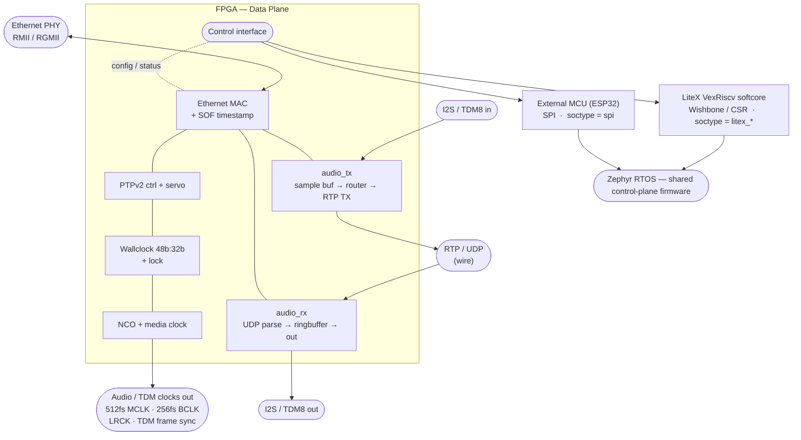
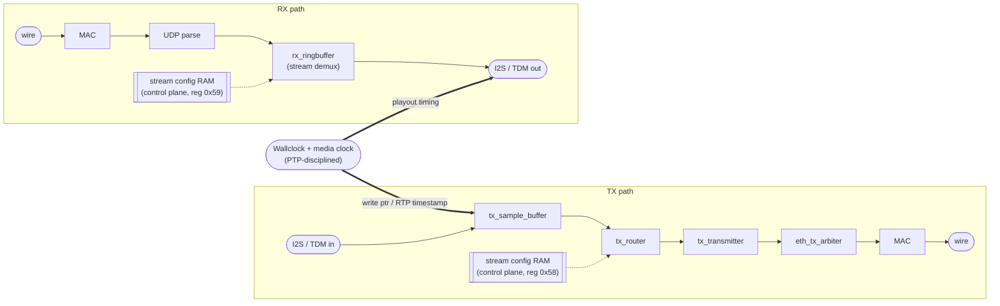
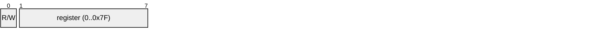

# AES67

A full AES67 Audio-over-IP implementation built around a single FPGA. The FPGA owns the entire **data plane** — Ethernet MAC, IEEE 1588 (PTPv2), a PTP-disciplined wallclock, media-clock derivation, RTP packetisation and I2S/TDM audio I/O — while a separate, swappable **control plane** running Zephyr RTOS handles the non-realtime work (network management, PTP BMC, stream announcement/discovery, configuration, web UI).

The defining feature of the design is that the control plane is **not fixed to one host**. The same FPGA core can be driven by:

- an **external MCU over SPI** (currently an ESP32-S3), or
- an **integrated LiteX RISC-V softcore** (VexRiscv) running on the FPGA itself

A single FPGA `soctype` generic and a single Zephyr `FPGA_HAL_*` Kconfig choice pick which transport is built. Everything above the transport layer — PTP BMC, SAP/SDP, RTSP, configuration, the web UI — is shared C code that runs unchanged on any of them.

> For transparency: this is primarily a learning project. I had no FPGA experience before and only basic embedded experience (ESP32 + temperature-sensor level). Some code was LLM-generated, then human-checked and debugged. Expect rough edges — see [Status & Known Issues](#status--known-issues) and [todo.md](todo.md).

---

## Table of Contents

- [System Overview](#system-overview)
- [Control-Plane Backends](#control-plane-backends)
- [FPGA Architecture (Data Plane)](#fpga-architecture-data-plane)
- [SPI Control Interface](#spi-control-interface)
- [LiteX SoC (Integrated Softcore)](#litex-soc-integrated-softcore)
- [Firmware (Control Plane)](#firmware-control-plane)
- [Supported Boards](#supported-boards)
- [Building](#building)
- [Status & Known Issues](#status--known-issues)
- [Technical Notes](#technical-notes)
- [License](#license)

---

## System Overview



The data-plane logic is identical across all three; only the **control interface** that exposes the FPGA's register set changes. On the FPGA side this is selected by the `soctype` generic in [FPGA/top.vhd](FPGA/top.vhd). On the firmware side the matching transport is selected by `CONFIG_FPGA_HAL_*`, and the rest of the C application is unaware of which transport it is talking through, thanks to the HAL in [soc_firmware/app/drivers/fpga_hal/](soc_firmware/app/drivers/fpga_hal/).

---

## Control-Plane Backends

| Backend | FPGA `soctype` | Zephyr Kconfig | Host | Transport | Notes |
|---------|----------------|----------------|------|-----------|-------|
| **SPI** | `spi` | `CONFIG_FPGA_HAL_SPI` | External MCU (ESP32-S3) | SPI slave (`spictrl.vhd`) | Active focus for external-MCU boards. Ethernet frames tunnel over SPI. |
| **LiteX** | `litex_c10_hram`, `litex_c10_sdram`, `litex_tang_primer_20k` | `CONFIG_FPGA_HAL_LITEX` | On-FPGA VexRiscv softcore | LiteX CSR over Wishbone | Self-contained single-chip system; SoC boots from SPI flash. |

The HAL ([fpga_hal.h](soc_firmware/app/drivers/fpga_hal/fpga_hal.h)) presents one register-access API (`fpga_hal_write_mac`, `fpga_hal_read_status`, stream config, etc.). Backend `.c` files translate those calls into SPI transactions or CSR writes respectively. An `fpga` shell command tree ([fpga_hal_shell.c](soc_firmware/app/drivers/fpga_hal/fpga_hal_shell.c)) exposes the whole API at runtime regardless of backend.

---

## FPGA Architecture (Data Plane)

All time-critical audio and timing logic lives in [FPGA/](FPGA/). New logic is VHDL; a few audio-clock helpers are Verilog. The data-plane top is [FPGA/aes67_top.vhd](FPGA/aes67_top.vhd); the board/transport wrapper that instantiates it and the chosen control interface is [FPGA/top.vhd](FPGA/top.vhd).

### Ethernet
| Module | File | Description |
|--------|------|-------------|
| Ethernet MAC | [FPGA/FPGA_Ethernet/](FPGA/FPGA_Ethernet/) | Fork of the YOL MAC with start-of-frame timestamp output (git submodule) |
| RMII/SMII bridge | [FPGA/mii_rmii/](FPGA/mii_rmii/) | RMII↔MII glue for 100 Mbit PHYs (git submodule) |
| MII timestamp | [FPGA/ethernet_timestamp_mii.vhd](FPGA/ethernet_timestamp_mii.vhd) | Latches the 48b:32b wallclock at the SOF delimiter |
| TX arbiter | [FPGA/eth_tx_arbiter.vhd](FPGA/eth_tx_arbiter.vhd) | Arbitrates PTP / audio / control-plane egress onto the MAC |
| Packet aggregator | [FPGA/ethernet_packet_aggregator.vhd](FPGA/ethernet_packet_aggregator.vhd) | Assembles outgoing frames |
| LiteX bridge | [FPGA/litex_eth_buffer_bridge.vhd](FPGA/litex_eth_buffer_bridge.vhd) | Dual-port buffer bridge between MAC and LiteX SoC |

### PTP (IEEE 1588 / PTPv2)
| Module | File | Description |
|--------|------|-------------|
| Controller | [FPGA/ptp/ptpv2_controller.vhd](FPGA/ptp/ptpv2_controller.vhd) | State machine: Sync, Follow_Up, Announce, Delay_Req/Resp |
| Parser | [FPGA/ptp/ptpv2_parser.vhd](FPGA/ptp/) | Extracts timestamps, computes offset / mean path delay |
| Servo | [FPGA/ptp/ptpv2_servo.vhd](FPGA/ptp/ptpv2_servo.vhd) | PI controller for clock discipline (PPB output) |
| Sender | [FPGA/ptp/ptpv2_sender.vhd](FPGA/ptp/) | Builds PTP egress packets |

PTP runs on-FPGA in all modes. The control plane only runs the **BMC** (best-master-clock) decision and feeds the resulting GM priorities/identity back into the FPGA over the control interface.

### Clock & Timing
| Module | File | Description |
|--------|------|-------------|
| Wallclock | [FPGA/wallclock.vhd](FPGA/wallclock.vhd) | PTP-disciplined 48-bit seconds + 32-bit nanoseconds |
| NCO + media clock | [FPGA/wallclock.vhd](FPGA/wallclock.vhd) | NCO for PLL phase reference; media-clock counter for RTP timestamps |
| Audio clock gen | [FPGA/audioclock_generator_sysclk.vhd](FPGA/audioclock_generator_sysclk.vhd) | Derives BCLK/LRCK domain |
| PPB meter | [FPGA/clock_ppb_meter.vhd](FPGA/clock_ppb_meter.vhd) | Measures NCO-vs-external-PLL phase → PPB correction |

### Audio
| Module | File | Description |
|--------|------|-------------|
| TX router | [FPGA/audio_tx/tx_router.vhd](FPGA/audio_tx/) | Per-stream config RAM, sample aggregation |
| TX transmitter | [FPGA/audio_tx/tx_transmitter.vhd](FPGA/audio_tx/) | RTP packet construction with SSRC |
| TX sample buffer | [FPGA/audio_tx/tx_sample_buffer.vhd](FPGA/audio_tx/) | Media-clock-paced ring buffer; integrated TDM demux |
| TDM8 in | [FPGA/audio_tx/tdm8_in.vhd](FPGA/audio_tx/) | 8-channel TDM input (legacy parallel path) |
| RX ringbuffer | [FPGA/audio_rx/rx_ringbuffer.vhd](FPGA/audio_rx/) | Stream demux + playout buffer |
| I2S in / out | [FPGA/I2S_IN.vhd](FPGA/I2S_IN.vhd), [FPGA/audio_rx/i2s_out.vhd](FPGA/audio_rx/) | 48 kHz / 24-bit I2S de/serialiser |
| TDM8 out | [FPGA/audio_rx/tdm8_out.vhd](FPGA/audio_rx/) | 8-channel TDM output |

### Configurable Generics

The core is parameterised through the generics on [aes67_top.vhd](FPGA/aes67_top.vhd) (mirrored by the board wrapper [top.vhd](FPGA/top.vhd)). The most useful ones:

| Generic | Default | Purpose |
|---------|---------|---------|
| `ETHERNET_TYPE` / `MII_WIDTH` | `"RMII"` / `2` | PHY interface (`RMII` 100 Mbit or `RGMII` Gigabit) and MII data width |
| `SYS_CLK_NS_PER_TICK` / `MII_CLK_NS_PER_TICK` | `8` / `20` | System (125 MHz) and MII clock periods — keep in sync with the actual clocks |
| `TX_MAX_STREAMS` / `RX_MAX_STREAMS` | `8` / `8` | Maximum concurrent TX / RX RTP streams |
| `TX_CHANNELS` / `RX_CHANNELS` | `16` / `16` | Audio channel count (×2 for I2S, ×8 for TDM8) |
| `TX_BYTE_DEPTH` / `RX_BYTE_DEPTH` | `3` / `3` | Sample width in bytes (3 = 24-bit) |
| `TX_SAMPLE_BUFFER_DEPTH` | `64` | TX ring depth — **must be a power of two** (media-clock write pointer) |
| `RX_SAMPLE_BUFFER_DEPTH` | `256` | RX playout buffer depth (latency vs. jitter tolerance) |
| `AUDIO_INPUT_MODE` / `AUDIO_OUTPUT_MODE` | `"tdm8"` / `"tdm8"` | `i2s` or `tdm8` framing per direction |
| `AUDIO_TX/RX_USE_PARALLEL_INTERFACE` | `false` | `false` = TDM de/mux integrated into the sample buffer (cheaper); `true` = legacy external `tdm8_in`/parallel bus |
| `USE_EXTERNAL_PLL` | `true` | `true` = drive audio clocks from the external Si5351A; `false` = use the on-chip NCO-generated clocks directly |
| `ENABLE_METERING` | `true` | Per-channel signal/clip metering (read via reg `0x30`); set `false` to drop it and save logic |
| `MIIM_CLOCK_DIVIDER` / `MIIM_PHY_ADDRESS` | `50` / `0` | MDIO clock divider and PHY management address |

Defaults give a 48 kHz / 24-bit endpoint with up to 8 TX and 8 RX streams over 16 channels each.

### Data Flow



---

## SPI Control Interface

When `soctype = "spi"`, the FPGA exposes its register set through [FPGA/spictrl.vhd](FPGA/spictrl.vhd), an SPI client (spi logic built on Jakub Cabal's [spi-fpga](https://github.com/jakubcabal/spi-fpga) core, SPI mode 0, MSB-first byte order). This is the path used when Zephyr runs on an external MCU such as the ESP32-S3. The driver side is [drivers/fpga_spi/](soc_firmware/app/drivers/fpga_spi/) + [fpga_hal_spi.c](soc_firmware/app/drivers/fpga_hal/fpga_hal_spi.c).

### Protocol

Each transaction begins with a **command byte**:



Bit 7 is the direction (`1` → write, `0` → read); bits 6..0 select the register. The command byte is followed by that register's fixed-length payload. **Field byte order is per register, not uniform** — scalar writes (MAC, IP) are big-endian/network order, while the multi-byte PTP status reads (`0x52`–`0x55`) are little-endian; each row below states which. Key properties:

- **CS is not used for framing.** Some masters (notably the ESP32) split a logical transfer into ≤64-byte hardware bursts and toggle CS between them. `spictrl` therefore tracks transaction length from the register's declared payload size, and for the packet registers (`0x20`/`0x22`) it keeps the transaction open across short CS-high gaps, only aborting after `PACKET_CS_GAP_TIMEOUT` (~2048 sys-clk cycles) of continuous CS-high.
- **Scalar writes are atomic.** Bytes for MAC/IP/flags/PTP-config land in a shadow register and are committed to the FPGA outputs only on the final byte, so a glitched/aborted burst never applies a half-written value.
- **Stream-config writes pass through byte-wise** to the TX/RX config block RAM.
- **`mcu_irq_o`** signals the host that a received Ethernet frame is waiting (active while a frame is pending).

### Read Registers

| Reg | Len | Field |
|-----|-----|-------|
| `0x00` | 8 B | FPGA info: ver MSB/LSB, TX streams, RX streams, TX ch, RX ch, bit depth, sample rate (kHz) |
| `0x21` | 2 B | RX Ethernet frame length (big-endian) |
| `0x22` | var | RX Ethernet frame data (length from `0x21`) |
| `0x30` | var | Channel metering: signal + clip bitmaps for RX then TX channels; reading clears |
| `0x50` | 1 B | Clocking status (see bit map below) |
| `0x51` | 1 B | Ethernet status: bit7 = link up, bits6..5 = speed (00=10, 01=100, 10=1000) |
| `0x52` | 4 B | PTP mean path delay (32-bit, **little-endian on the wire**: byte 0 = bits 7..0) |
| `0x53` | 4 B | PTP leader offset (32-bit signed, little-endian) |
| `0x54` | 8 B | PPB counters: bytes 0–3 PLL counter, bytes 4–7 wallclock counter (both little-endian) |
| `0x55` | 8 B | Current grandmaster clock identity (little-endian) |
| `0x61` | 22 B | PTP servo monitoring (only meaningful when `STATIC_PTP_CONF` is disabled) |

**`0x50` clocking status bits:**

| Bit | Meaning |
|-----|---------|
| 7 | PLL PPB measurement valid |
| 6 | Wallclock locked |
| 5 | Wallclock configured |
| 4 | PTP is leader |
| 3 | PTP is follower |
| 2 | Ethernet RX frame available |
| 1 | RX overflow |
| 0 | reserved |

### Write Registers

| Reg | Len | Field |
|-----|-----|-------|
| `0x20` | var | TX Ethernet frame to FPGA (2-byte big-endian length prefix, then payload) |
| `0x40` | 6 B | MAC address, atomic (byte 0 = MAC[47:40]) |
| `0x41` | 4 B | IP address, atomic (byte 0 = IP[31:24]) |
| `0x50` | 1 B | Control flags, atomic (see below) |
| `0x55` | 7 B | PTP config, atomic: time source, log sync interval, log announce interval, priority1, priority2, clock class, clock accuracy |
| `0x58` | 20 B | TX stream config → RAM base `stream_id × 32` |
| `0x59` | 18 B | RX stream config → RAM base `stream_id × 32` |
| `0x60` | 18 B | PTP servo/parser tuning block (ignored when `STATIC_PTP_CONF=TRUE`) |

**`0x50` control flags bits:**

| Bit | Meaning |
|-----|---------|
| 0 | Start PLL PPB measurement (level; auto-cleared when `pll_meas_valid` falls) |
| 1 | Reset wallclock |
| 2 | Reset PTP |
| 3 | Reset Ethernet |
| 4 | reserved (unused) |
| 5 | ADDA nRST (high = run) |
| 6–7 | reserved |

> Metering does not have a flag bit: the metering snapshot (read `0x30`) self-clears once the host has read out all metering bytes.

**`0x58` TX stream layout** (SPI byte → RAM offset): `0`→stream_id, `1–4`→dest IP, `5`→channel count, `6`→samples/packet/channel, `7–14`→channel IDs, `16–19`→SSRC.
**`0x59` RX stream layout**: `0`→stream_id (selects base, not stored), `1–4`→dest IP filter, `5–6`→dest UDP port filter, `7–14`→channel output map, `15`→channel count, `16`→output delay, `17`→samples/channel/packet.

> The authoritative, byte-exact field tables live in **[config_ram_address_map.md](config_ram_address_map.md)** and the decode logic in [spictrl.vhd](FPGA/spictrl.vhd). The LiteX CSR backend exposes the same logical register set over Wishbone.

A planned addition (see [todo.md](todo.md)) is a UART variant of this same protocol for MCUs without a spare SPI master, plus optional checksums on the external-MCU link.

---

## LiteX SoC (Integrated Softcore)

When a `litex_*` `soctype` is selected, the FPGA additionally hosts a LiteX-generated VexRiscv RISC-V softcore, so the whole AES67 endpoint — data plane *and* control plane — fits on one chip with no external MCU. Generated by [litex_soc/generate.py](litex_soc/generate.py) (emits portable Verilog into `litex_soc/build/`; the top-level feeds it clocks, no SoC-internal PLL).

### SoC Resources
| Resource | Details |
|----------|---------|
| CPU | VexRiscv RISC-V (sys clock typ. 75–80 MHz, supplied by top-level) |
| RAM | HyperRAM (Cyclone 10LP) or SDRAM (CYC1000) / DDR3 (Gowin) @ `0x20000000` |
| Flash | SPI flash (BIOS + firmware) @ `0x30000000` |
| CSR | Peripheral registers @ `0xf0000000` |
| Ethernet | MAC ↔ SoC via [litex_eth_buffer_bridge.vhd](FPGA/litex_eth_buffer_bridge.vhd) (dual-port packet buffers) |
| I2C / SPI / UART | Display + Si5351A PLL, SD card, console |

### Boot Flow
1. FPGA configures from its own configuration flash, bringing up data plane and SoC together.
2. A RISC-V boot stub at the SPI-flash reset vector ([litex_soc/boot_stub/](litex_soc/boot_stub/)) copies the LiteX BIOS into HyperRAM and sets the HyperRAM latency (6 CK power-on default).
3. The BIOS loads the Zephyr firmware image (`.fbi` format: binary + length + CRC-32 header) from flash.
4. Zephyr boots, brings up drivers, starts DHCP and the application threads.

---

## Firmware (Control Plane)

Zephyr RTOS application in [soc_firmware/app/](soc_firmware/app/) (Zephyr v4.2.0; west manifest at [soc_firmware/app/west-manifest/west.yml](soc_firmware/app/west-manifest/)). The same source tree builds for every backend; `main.c` is the full-feature entry point, while [src/main_spi_bringup.c](soc_firmware/app/src/main_spi_bringup.c) is a minimal SPI-only bring-up used while porting features to a new external-MCU board.

### Application Modules
| Module | File | Description |
|--------|------|-------------|
| Main | [src/main.c](soc_firmware/app/src/main.c) | Init, DHCP, network setup |
| PTP BMC | [src/ptp_bmc.c](soc_firmware/app/src/ptp_bmc.c) | IEEE 1588 best-master-clock on 224.0.1.129:320 |
| SAP/SDP | [src/sap_sdp.c](soc_firmware/app/src/sap_sdp.c) | Session announcement (239.255.255.255:9875) + foreign-stream discovery |
| SDP utils | [src/aes67_sdp_utils.c](soc_firmware/app/src/aes67_sdp_utils.c) | SDP parse/format, PTP clock-ID formatting |
| RTSP | [src/rtsp.c](soc_firmware/app/src/rtsp.c) | RAVENNA RTSP server/client (subscription, session control) |
| mDNS / DNS-SD | [src/mdns_sd.c](soc_firmware/app/src/mdns_sd.c) | RFC 6762/6763 responder + service advertisement |
| Webserver | [src/webserver.c](soc_firmware/app/src/webserver.c) | REST API + gzipped static web UI |
| Config | [src/aes67_config.c](soc_firmware/app/src/aes67_config.c) | Centralised runtime configuration + defaults |
| Config JSON | [src/config_json.c](soc_firmware/app/src/config_json.c) | JSON (de)serialisation shared by SD & flash storage |
| SD config | [src/sd_config.c](soc_firmware/app/src/sd_config.c) | SD-card persistence (FAT, crash-safe A/B slots) |
| Flash config | [src/flash_config.c](soc_firmware/app/src/flash_config.c) | SPI-flash config storage (8 KB slots, CRC-32) |
| FW update | [src/fw_update.c](soc_firmware/app/src/fw_update.c) | HTTP + shell firmware update, FBI verification |
| Card manager | [src/card_manager.c](soc_firmware/app/src/card_manager.c) | I2C board detect + runtime I/O-card selection |
| UI display | [src/ui_display.c](soc_firmware/app/src/ui_display.c) | SSD1306 OLED status |
| FPGA regs | [src/fpga_regs.c](soc_firmware/app/src/fpga_regs.c) | High-level register helpers (via HAL) |
| FPGA poll | [src/fpga_poll.c](soc_firmware/app/src/fpga_poll.c) | PTP-lock / link-state polling |
| PLL ctrl | [src/pll_ctrl.c](soc_firmware/app/src/pll_ctrl.c) | Si5351A PPB correction from FPGA measurements |

### Drivers
| Driver | Path | Description |
|--------|------|-------------|
| FPGA HAL | [drivers/fpga_hal/](soc_firmware/app/drivers/fpga_hal/) | Backend-agnostic register access (SPI / LiteX) |
| FPGA SPI | [drivers/fpga_spi/](soc_firmware/app/drivers/fpga_spi/) | Low-level `spictrl` SPI master (external-MCU transport) |
| LiteX Ethernet | [drivers/eth_litex/](soc_firmware/app/drivers/eth_litex/) | Zephyr netif via LiteX CSR + Wishbone buffers |
| Si5351A | [drivers/si5351a/](soc_firmware/app/drivers/si5351a/) | I2C clock generator with PPB correction |
| SPI flash | [drivers/spi_flash/](soc_firmware/app/drivers/spi_flash/) | LiteSPI master for FW update & config (LiteX only) |
| Display ctrl | [drivers/display_ctrl/](soc_firmware/app/drivers/display_ctrl/) | LED / button / 7-seg + SSD1306 |
| MI / LO / IO cards | [drivers/mi_card/](soc_firmware/app/drivers/), [lo_card/](soc_firmware/app/drivers/), [io_card/](soc_firmware/app/drivers/) | Analog I/O card control (I2C) |

---

## Supported Boards

Targets are at various maturity levels — the build matrix is still being shaken out (see [todo.md](todo.md)).

| Board | FPGA | Control plane | RAM | Status |
|-------|------|---------------|-----|--------|
| Cyclone 10LP eval (`litex_vexriscv_cyclone10`) | 10CL025YU256I7G | LiteX softcore | HyperRAM | Primary single-chip target |
| CYC1000 (`litex_vexriscv_cyc1000`) | 10CL025YU256C8G | LiteX softcore | SDRAM | Working |
| ESP32-S3 DevKitC + FPGA (`esp32s3_devkitc`) | (any) | External ESP32-S3 over SPI | ESP32 PSRAM | SPI bring-up in progress |
| Tang Primer 20K (`litex_tang_primer_20k`) | Gowin GW2A-18C | LiteX softcore | DDR3 | Experimental (Gowin EDA Ethernet clock-tree issues) |

FPGA boards/pinouts live under [FPGA/boards/](FPGA/boards/) (Altera / Gowin); Zephyr board configs under [soc_firmware/app/boards/](soc_firmware/app/boards/).

---

## Building

### FPGA
Open [FPGA/FPGA.qpf](FPGA/) in Intel Quartus Prime 25.1 (primary device `10CL025YU256I7G`), or build the Gowin target with the Gowin EDA. Select the build via the `soctype` generic in [FPGA/top.vhd](FPGA/top.vhd) (`spi`, `litex_c10_hram`, `litex_c10_sdram`, `litex_tang_primer_20k`). Pull submodules first:

```bash
git submodule update --init --recursive
```

### LiteX SoC (only for `litex_*` targets)
```bash
cd litex_soc
make    # runs generate.py → SoC Verilog + device tree + CSR headers in build/
```
Regenerate after editing `generate.py`; generated headers are imported via `litex_csr_compat.h`.

### Firmware (Zephyr)
```bash
cd soc_firmware/app
source ../.venv/bin/activate          # west venv

# Integrated LiteX softcore (single-chip):
west build -b litex_vexriscv_cyclone10 -p

# External ESP32-S3 over SPI:
west build -b esp32s3_devkitc/esp32s3/procpu -p
```
The build selects the FPGA HAL backend automatically from the board's Ethernet/SPI Kconfig (`CONFIG_FPGA_HAL_LITEX` / `CONFIG_FPGA_HAL_SPI`). LiteX builds produce a `.fbi` flash image (binary + length + CRC-32 header) for loading via the LiteX BIOS.

---

## Status & Known Issues

**Working**
- Ethernet RX/TX over both transports (SPI tunnelled, LiteX CSR)
- Network config (MAC, DHCP)
- PTPv2 leader + follower with on-host BMC; wallclock discipline & media-clock derivation
- Si5351A PPB correction; audio TX/RX (48 kHz/24-bit, I2S and TDM8); RTP gen/parse
- SAP/SDP announce + foreign-stream discovery
- Webserver (REST + gzipped UI); persistent config (SD A/B slots + SPI-flash fallback)
- HTTP + shell firmware update (FBI/CRC-32); internal routing matrix
- LiteX single-chip boot from SPI flash; runtime I/O-card detection; SSD1306 status
- External-MCU (ESP32-S3) SPI control + register bring-up

**In progress / rough**
- Reset structure rework; clean state-machine recovery on all FPGA modules
- Expose full FPGA generic config over the control interface
- 100 Mbit Ethernet on a Gigabit PHY; `std_logic` vs `std_ulogic` cleanup; remove unused registers
- TX packet-buffer RAM timing (intermittent, Quartus-mood-dependent)
- RAVENNA RTSP and mDNS/DNS-SD verification
- ESP32 PSRAM under Zephyr; Gowin Ethernet clock-tree debugging
- PI-controller tuning (≈ ±30  ns jitter when locked); PTP is logic-heavy (see resource usage); phase-jump handling

The full, candid task list is in **[todo.md](todo.md)**.

---

## Technical Notes

### Resource usage

Rough numbers measured on a Cyclone 10LP (10CL025, ~24.6k LEs); Gowin (Tang Primer 20K) lands in the same ballpark. "LE" = logic element / 4-input-LUT-equivalent.

| Block | ~LEs | Notes |
|-------|------|-------|
| TX path | 1600 | sample buffer, router, transmitter, TX arbiter |
| RX path | 600 | UDP parse, ringbuffer/demux, output |
| PTP (controller + parser + servo + sender) | 5500 | the dominant cost — discipline maths and timestamping |
| **Data-plane core total** | **~8800** | everything in [FPGA Architecture](#fpga-architecture-data-plane) |
| SPI control frontend | ~800 | `spictrl` SPI slave (external-MCU build) |
| LiteX SoC (full config) | ~7000 | VexRiscv + Wishbone + peripherals (integrated build) |

So a single-chip LiteX build is roughly `core + SoC ≈ 8800 + 7000`, and an external-MCU build is `core + SPI ≈ 8800 + 800` with the rest of the control plane living off-FPGA. Disabling `ENABLE_METERING`, trimming stream/channel counts, or buffer depths trades features for area; PTP is where the big wins would be (see [todo.md](todo.md) — moving discipline maths to the host is a stretch goal).

### PTP clock discipline
[ptpv2_servo.vhd](FPGA/ptp/ptpv2_servo.vhd) is a PI controller: it filters offset measurements, outputs a frequency correction in PPB, and has lock detection with hysteresis (defaults 500 ns lock / 5 µs unlock) and message-interval-aware gain scaling. With dynamic tuning enabled it is configurable from the control plane (SPI reg `0x60` / equivalent CSR).

### Media-clock generation
[wallclock.vhd](FPGA/wallclock.vhd) generates a reference using an NCO for PLL discipline: the NCO outputs (BCLK/LRCK) provide a phase reference, [clock_ppb_meter.vhd](FPGA/clock_ppb_meter.vhd) compares NCO edges against the external Si5351A and produces a PPB correction, and the Si5351A supplies the actual low-jitter audio clocks. The media-clock counter (`seconds × 48000 + sample_in_second`) drives RTP timestamps. The NCO itself carries ±1 sys-clk-period (≈8 ns) jitter — fine for measurement, not for direct I2S.

### Hardware constraints
- HyperRAM boot latency is set to 6 CK by the boot stub before executing from HyperRAM.
- PTP CDC synchronizers carry `PRESERVE` attributes — do not strip them.
- The boot stub must fit in the first flash sector; the BIOS is copied to the top of HyperRAM.

---

## License

See [LICENSE.md](LICENSE.md). Third-party cores retain their own licenses: the SPI slave is MIT ([jakubcabal/spi-fpga](https://github.com/jakubcabal/spi-fpga)); the Ethernet MAC and RMII bridge are pulled in as submodules under their respective upstream licenses.
